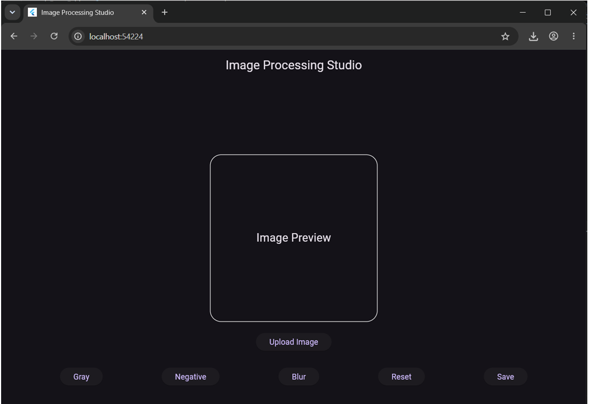

# Image Processing Studio

A Flutter web application for basic image editing.
## screenshot

## Features
- Upload image
- Gray filter
- Negative filter
- Blur effect
- Reset image
- Save edited image

## Technologies Used
- Flutter
- Dart
- image package
- image_picker package

## Run Project

```bash
flutter pub get
flutter run -d chrome
```

## Author
Gurleen